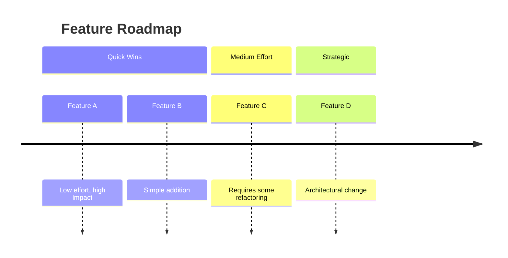
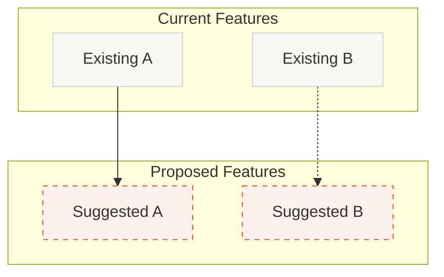

# Roadmap: Feature & Improvement Suggestions

Analyze the codebase and generate a visual roadmap of potential features and improvements. Track progress with todos.

## Todo List

Create these todos with `todo_write` and update as you go:

1. Scan codebase architecture, patterns, and conventions
2. Identify feature gaps and improvement opportunities
3. Create timeline diagram (phased overview)
4. Create current vs proposed flowchart (integration points)
5. Ask user which features to plan

## Analysis Focus

Look for opportunities in these areas:

- Missing common patterns (auth, caching, error handling, logging)
- Performance optimization opportunities
- Developer experience improvements
- User-facing feature enhancements
- Code quality / refactoring candidates

## Diagram 1: Timeline Overview

A phased roadmap showing features by effort level.

- 3 sections: Quick Wins, Medium Effort, Strategic
- Group related features within each phase
- Colors: warm neutrals with themed variables

## Diagram 2: Current vs Proposed Flowchart

Visual distinction between existing and suggested features.

- Solid borders (#F7F7F4, #D4D4D0): existing features
- Dashed orange borders (#FEF0ED, #F34F1D): proposed features
- Solid arrows: direct dependencies
- Dashed arrows: suggested connections

