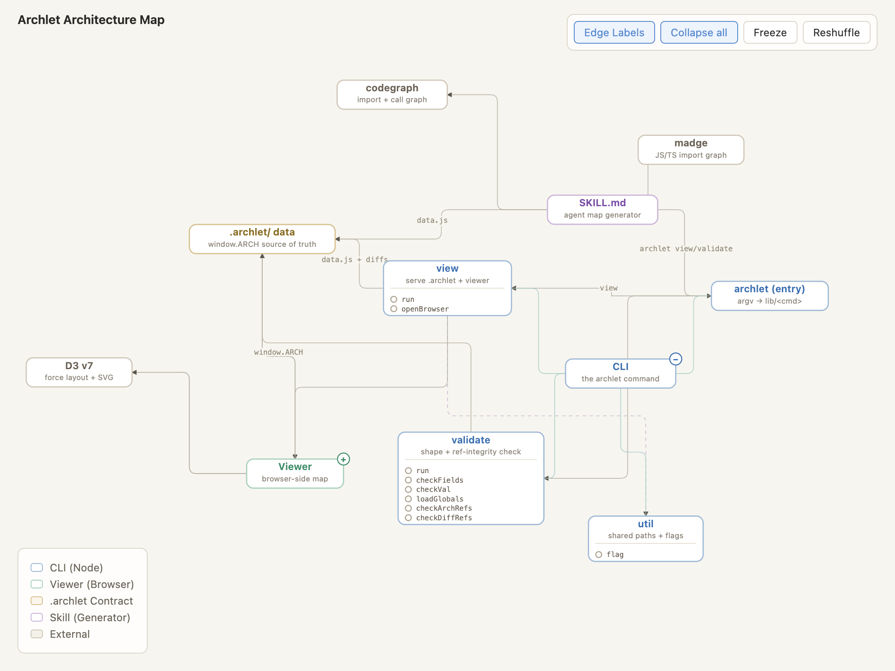

# archlet



> A small helper that tries to keep Engineers in step with the pace of Vibe Coding.

We're a team that's been doing Vibe Coding for a while, so we keep running into the same thing: the architecture you *think* you have in your head, and the one the code has quietly grown into, slowly drift apart (sometimes in one corner, sometimes to the point where you don't quite recognize the whole thing anymore haha)

archlet does something pretty plain: it lets your coding agent read the whole codebase, draw it as a map you can click into and drill down through, and show it to you. After a PR, you can also overlay that change onto the map to see exactly what it touched.

If this is a pain you share, and you happen to have some Tokens to burn, give it a try. If it helps you even a little, those Tokens weren't wasted.

## The simplest way to try it

Paste this to your coding agent (Claude Code, Codex, ...) from inside your codebase:

```
Follow https://raw.githubusercontent.com/superdesigndev/archlet/main/SKILL.md and build a map for this project
```

That's it. The agent reads the instructions, maps the repo, and opens the viewer for you.

## How it works

Two pieces:

- **A skill** — handed to a coding agent like Claude Code. It scans the code, picks a layering, and writes the architecture into `.archlet/data.js` (the single source of truth, and a draft you're free to hand-edit).
- **A viewer** — a small local server that renders `.archlet/` into a map you can expand and collapse.

archlet doesn't draw the underlying graph from scratch — it stands on the shoulders of two excellent tools, and owes them most of the credit:

- [**codegraph**](https://www.npmjs.com/package/@colbymchenry/codegraph) — does the real extraction. The skill runs it to pull out the route inventory and the import + call graph, which lands in `.codegraph/codegraph.db`. The call graph in particular is what lets the map go beyond "files that import files."
- [**madge**](https://github.com/pahen/madge) — the trusty JS/TS import-graph workhorse, used to cross-check and fill in module dependencies on JS/TS roots.

What the agent adds on top is the judgement: reading that raw graph, picking a layering, naming the modules, and turning it into something you can actually click through. That's the part that burns the Tokens. The CLI itself only handles two small jobs: serving the map and validating the data.

## Usage

If you'd rather install the skill properly first:

```bash
npx skills add superdesigndev/archlet
```

Then ask it to map this repo — something as plain as "map this project's architecture." Either way, when it's done it writes `.archlet/` and brings up a viewer:

```bash
npx archlet view          # open the map at localhost:4173
npx archlet validate      # check that .archlet/ data is self-consistent
```

To see how a change lands on the map, ask it to "overlay PR #123." It generates a diff overlay you can switch to from the viewer's Diffs menu.

## A few notes

- This is an early, small thing. It's happy to help where it can; it isn't trying to solve everything.
- It isn't easy on Tokens — it's essentially trading compute for clarity. Whether that's worth it is your call.
- The map is drawn by an agent, so it will occasionally misread something.

MIT License.
